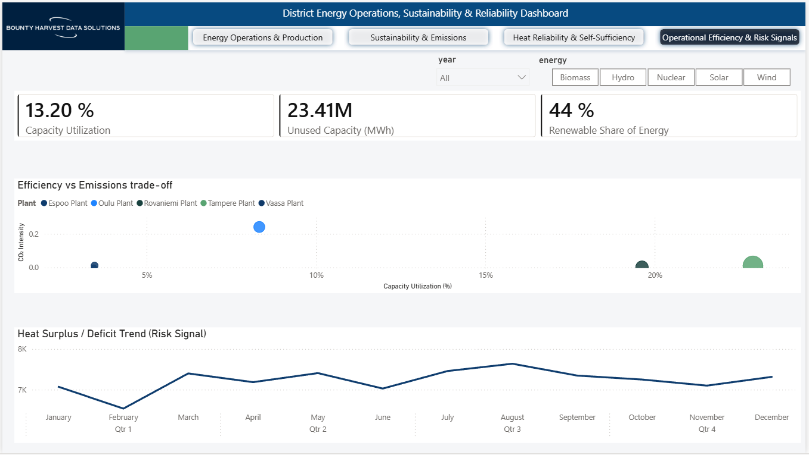
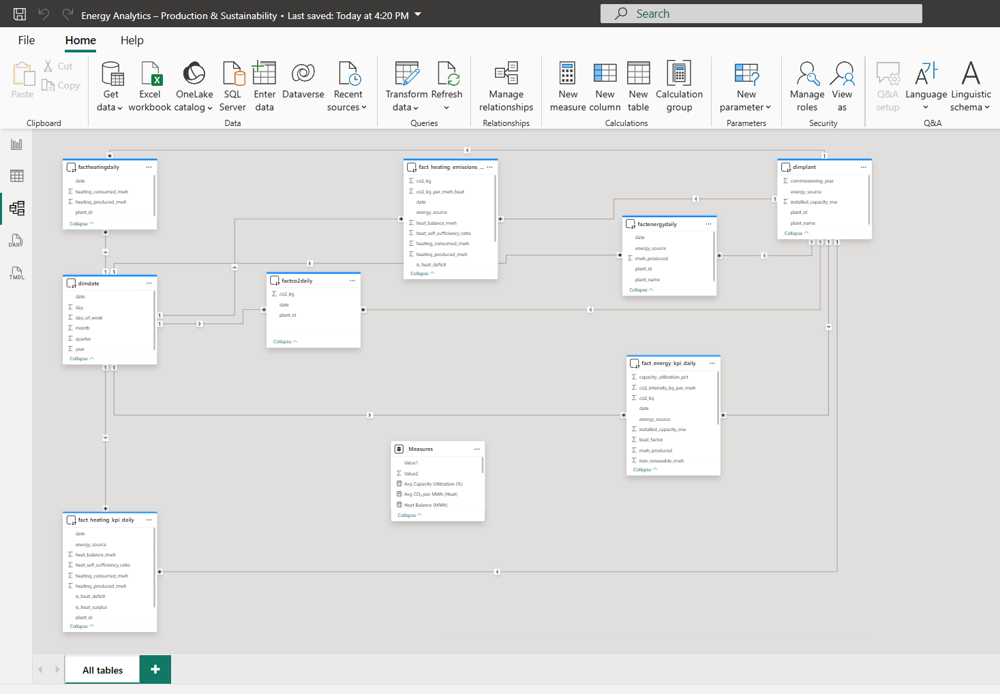
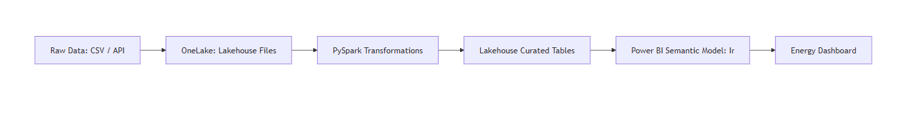
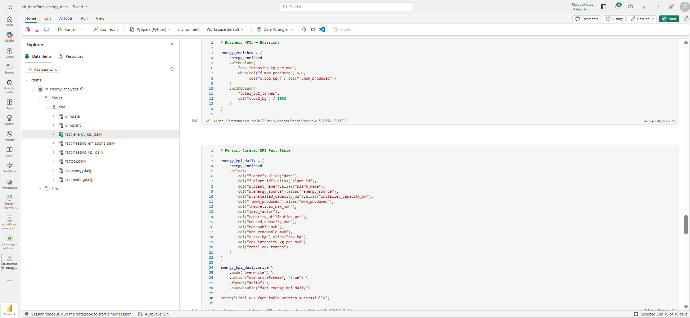
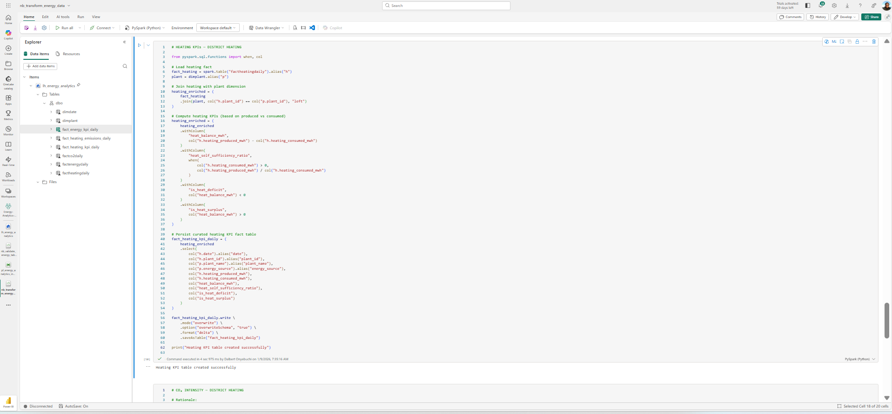
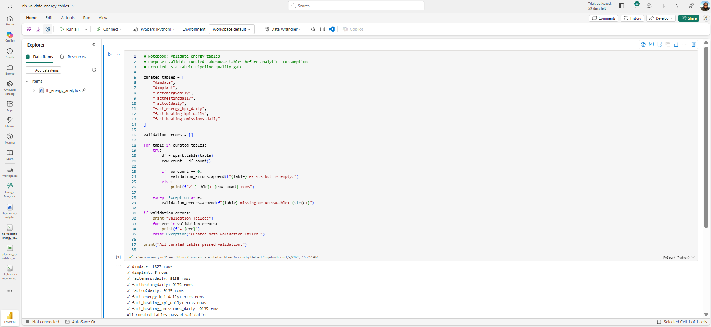

# District Energy Intelligence Platform: From Silos to Strategic Assets

**Role:** Lead Data Engineer & Strategic Data Analyst  
**Tech Stack:** Microsoft Fabric (OneLake, PySpark, SQL Endpoint), Power BI (DirectLake)  
**Core Impact:** Unified siloed telemetry to recover **€4.9M** in avoidable efficiency costs.


**[🔗 View Live Power BI Dashboard](https://app.powerbi.com/view?r=eyJrIjoiMjhjM2Y3MzUtOThjYS00ZjBiLWEwMDEtMTc0MjAxNGJjMWYxIiwidCI6Ijk1N2VlNTFkLWZkOTktNGNjZC1iOGUxLTZlMDE0MjE3NzM3ZiIsImMiOjh9)**

---

## 🎯 The Vision: Bridging the Gap Between Waste & Finance

In the modern energy sector, data is often trapped in operational silos—telemetry, emissions tracking, and grid consumption exist in isolation. This platform was engineered within **Microsoft Fabric** to unify these streams into a **Single Source of Truth**, enabling data-driven decisions across three critical pillars:

* **Operational Excellence:** Optimizing plant load factors to reclaim **23.41M MWh** of unused capacity.
* **ESG Leadership:** Real-time tracking of carbon intensity, maintaining a fleet average of **0.05 kg/MWh** (Target: 0.10).
* **Grid Resilience:** Monitoring heat balance to sustain a **102.59% self-sufficiency** rating.


---

## 💰 Key Outcome: Financial & Operational Impact

By unifying disparate datasets, I identified critical operational risks that were previously buried in siloed telemetry:

| Metric | Result | Strategic Insight |
| :--- | :--- | :--- |
| **Efficiency Risk** | 81,744 MWh | Identified recorded excess waste across the fleet. |
| **Financial Impact** | **€4,904,640** | Translated technical waste into a recovery narrative. |
| **Primary Driver** | Tampere Plant | Pinpointed Nuclear production as the leading risk contributor. |
| **Fleet Utilization** | 13.2% | Highlighted massive scaling opportunity without further CAPEX. |

---

## 🏗️ Technical Implementation (The "How")

The project is divided into three specialized workstreams/projects to demonstrate full-stack Fabric proficiency:

### [Project 1: Energy BI & Analytics Solution - _Analytics & Semantic Modeling_](./projects/project1-energy-bi/README.md)
* **Design:** Implemented a robust **Star Schema** to handle 100M+ rows of sensor data.
* **Innovation:** Utilized **Calculation Groups** for dynamic "Actual vs. Budget" energy comparisons.
* **Visual:** 


> **Executive Summary:** An end-to-end Microsoft Fabric solution that refactors siloed plant operations data into strategic assets, translating technical grid waste into actionable financial insights and ESG leadership metrics.

### [Project 2: End-to-End Fabric Data Pipeline & Automation - _Data Engineering & Medallion Pipelines_](./projects/project2-fabric-pipeline/README.md)
* **Architecture:** Multi-layered **Medallion (Bronze/Silver/Gold)** architecture in OneLake.
* **Transformation:** Used **PySpark** for complex energy unit conversions and  validation logic.
* **Visual:** 






**Validation Logic:**



### [Project 3: Fabric Governance, Security and CI/CD Framework - _Governance & Enterprise Security_](./projects/project3-governance-cicd/docs/project3_governance_framework.md)
* **Security:** Defined **Row-Level Security (RLS)** to ensure plant managers only see their specific telemetry.
* **DevOps:** Established a CI/CD workflow using **Fabric Deployment Pipelines** and GitHub integration.

---

## 📁 Repository Structure

```text
energy-analytics-fabric-bi/
├── docs/                      # Global Architecture & Governance Blueprints
├── projects/
│   ├── project1-energy-bi/    # PBIX metadata, DAX measures, Theme files
│   ├── project2-engineering/  # PySpark Notebooks, Pipeline JSON definitions
│   └── project3-governance/   # CI/CD configs & RLS security documentation
└── README.md                  # Portfolio Home Page
```


Together, these projects demonstrate a complete, production-aligned Fabric ecosystem including ingestion, transformation, modelling, reporting, governance, operations, and deployment automation.

---

## 🎯 Key Objectives

- **Scalability:** Design a platform capable of handling millions of rows of operational energy data.

- **Single Source of Truth:** Compute complex KPIs upstream in Spark to ensure consistency across all downstream tools.

- **Governance:** Implement a "Least Privilege" security model and a structured release process.

- **Performance:** Balance the heavy lifting of Spark with the lightning-fast interactivity of Power BI.

---

## 🛠️ Technology Stack

- **Storage:** Microsoft Fabric OneLake & Lakehouse (Delta Lake format).

- **Compute:** Spark (PySpark Notebooks) & SQL Analytics Endpoints.

- **Orchestration:** Fabric Data Pipelines.

- **Reporting:** Power BI (Import Mode, DAX, Calculation Groups).

- **DevOps:** GitHub Repository Integration & Fabric Deployment Pipelines.


---

## 🚀 Project Summaries

### [Project 1: Energy BI & Analytics Solution](./projects/project1-energy-bi/README.md)

A full business intelligence solution built using Power BI and Fabric semantic models. Includes data modelling using a **Star Schema**, calculation groups, and energy-sector KPIs (production, demand, emissions).


---

### [Project 2: End-to-End Fabric Data Pipeline & Automation](./projects/project2-fabric-pipeline/README.md)

An end-to-end data engineering workflow using **PySpark** and **Medallion Architecture**. It covers Lakehouse-based ingestion, dimensional modeling, and pipeline orchestration with automated quality gates.


---

### [Project 3: Fabric Governance, Security and CI/CD Framework](./projects/project3-governance-cicd/docs)

Illustrates enterprise management of Fabric: Workspace strategy (Dev/Test/Prod), **RLS/OLS** security models, and **CI/CD** using deployment pipelines and Git integration.

---

## Documentation

All architecture, governance, and design materials are located in [/docs](./docs).

Key documents include:

- [Fabric architecture diagrams](./docs/architecture/overall_fabric_architecture.md)
- [Security and access models](./docs/architecture/project3_governance_architecture.md#5-security-model)
- [Naming standard](./docs/architecture/project3_governance_architecture.md#6-governance-standards)
- [CI/CD process documentation](./docs/architecture/project3_governance_architecture.md#8-cicd--deployment-process)

These documents are written to reflect enterprise standards.

---

## 🧭 How to Navigate This Repository

1. Start with the [/docs](./docs) folder to understand the architecture and governance design.

2. **Explore Engineering:** See [Project 2](./projects/project2-fabric-pipeline) for the Spark ingestion and transformation pipelines.

3. **Explore Analytics:** See [Project 1](./projects/project1-energy-bi) for the BI solution and Star Schema.

4. **Explore Operations:** See [Project 3](./projects/project3-governance-cicd) for governance and deployment artefacts.

---

## 📧 Contact & Professional Context

This repository is a demonstration of architectural capability in the Microsoft Fabric ecosystem. It reflects a commitment to code-first engineering, rigorous governance, and high-performance data delivery.


