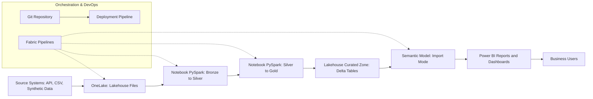

# Overall Microsoft Fabric Architecture

This document describes the end-to-end architecture implemented across all three projects within this repository. The solution follows a modern data and analytics architecture aligned with enterprise design principles and the governance requirements of a large energy-sector organisation.

---

## 1. Architectural Overview

The solution is built around Microsoft Fabric, leveraging the following core capabilities:

- **OneLake / Lakehouse** as the primary storage and transformation layer.
- **Spark-Driven Ingestion** for landing raw files into Lakehouse Files.
- **Notebooks (PySpark)** for scalable transformations and dimensional modeling.
- **Fabric Pipelines** for orchestration, quality gates, and semantic model refreshes.
- **Power BI Semantic Models** utilizing **Import Mode** for a high-performance, responsive reporting experience.
- **Git integration** for source control and CI/CD.

---

## 2. High-Level Architecture Diagram

---

## 3. Storage Layers

### Raw Zone (Bronze/Files)  
Stores ingested data in its native format. This layer ensures data integrity and provides a source of truth for auditing and historical reprocessing.

### Curated Zone (Gold/Tables) 
Stores cleaned, transformed, and model-ready data in Delta Lake format. These tables represent the "Gold" layer of the Medallion architecture, optimized for analytical queries.

---

## 4. Transformation Strategy

- Code-First Engineering: All data processing is performed using PySpark Notebooks. This ensures the solution is scalable, modular, and can handle complex logic like energy unit conversions and carbon intensity calculations.

- KPI Computation: Business-critical KPIs are calculated in Spark rather than DAX. This ensures that any tool consuming the Gold layer (not just Power BI) sees the same "Single Version of the Truth."

- Idempotency: Pipelines are designed to be re-run safely without creating duplicate data.

---

## 5. Semantic Layer and Reporting

The semantic layer is optimized for user experience and performance:

- Star Schema: Optimized for the VertiPaq engine to ensure high compression and fast filtering.

- Import Mode: Data is loaded into the Power BI memory engine. This provides the most responsive end-user experience, enabling sub-second visual rendering even with complex energy-sector calculations.

- Orchestrated Refreshes: The Fabric Pipeline triggers the Semantic Model refresh only after the PySpark transformations and quality checks have successfully completed.

---

## 6. Deployment Architecture

The deployment model uses:

- GitHub acts as the source of truth for all Fabric items (Notebooks, Pipelines, and Model Metadata).

- Fabric Git Integration allows developers to sync changes between the workspace and the repo.

- Deployment Pipelines manage the automated promotion of artifacts through Development, Test, and Production.

---

## 7. Governance Considerations

Key governance elements include:

- Workspace Separation: Environments are isolated to prevent unauthorized changes to production.

- Naming Standards: Adherence to enterprise conventions for clear asset discovery.

- Quality Gates: The pipeline includes a *Validation Notebook*; if row counts or data types fail checks, the downstream Semantic Model refresh is automatically halted to prevent "bad data" from reaching reports.

---

## 8. Summary

This architecture reflects a production-ready, Spark-centric environment. By leveraging *Import Mode* for the final reporting layer, the platform combines the massive processing power of Spark with the lightning-fast interactivity of Power BI, meeting the high standards of performance and reliability required in the energy sector.