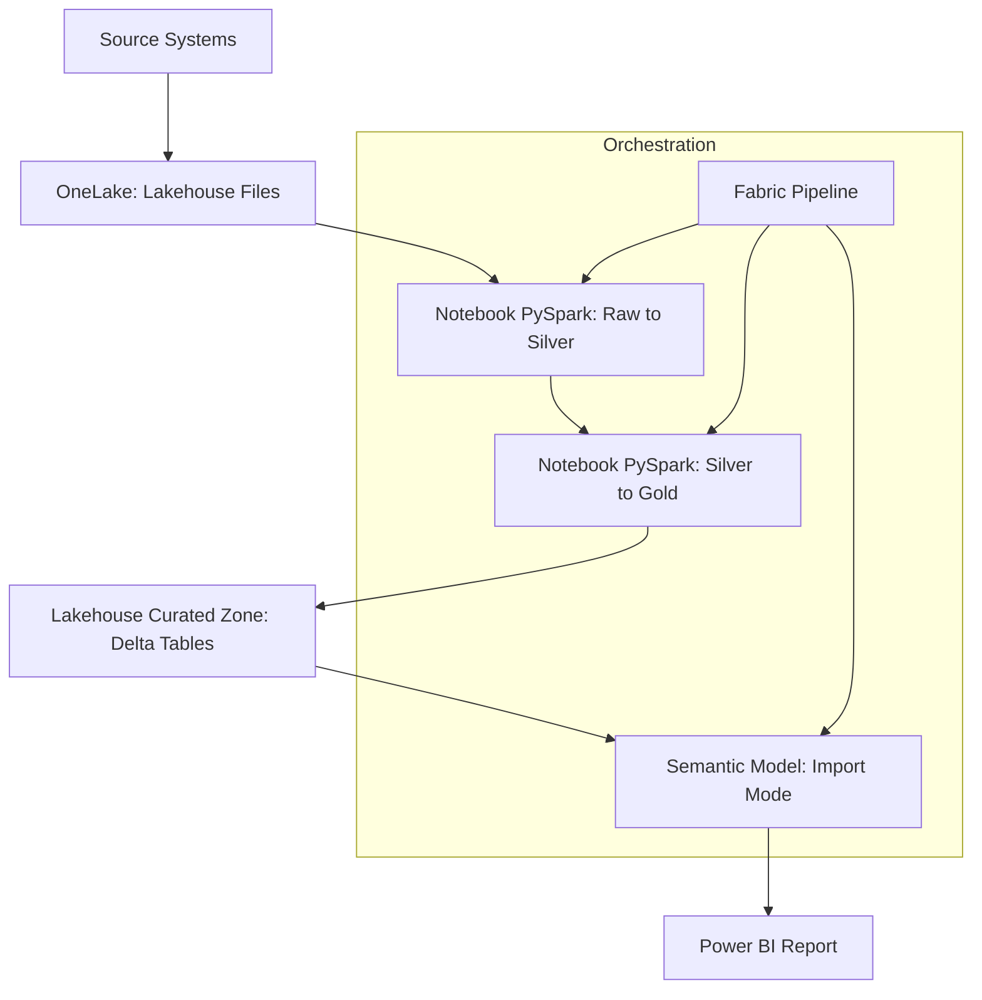

# Project 2: End-to-End Fabric Pipeline Architecture

This document describes the architecture of the ingestion, transformation, and orchestration pipeline implemented using **Microsoft Fabric.** The design demonstrates how operational data moves through a governed, scalable, and automated analytics environment.

---

## 1. Purpose

The purpose of this project is to build a production-aligned data engineering pipeline that:

- **Ingests** raw data from source systems into the **OneLake** foundation.

- **Processes** and standardizes raw data using **PySpark** for high-performance computing.

- **Applies** complex business transformations and energy-sector KPIs at scale.

- **Produces** curated, analytics-ready **Delta Tables** within a Fabric Lakehouse.

- **Automates** orchestration, quality validation, and semantic model refreshes via **Fabric Pipelines.**

This pipeline demonstrates Microsoft Fabric’s ability to support enterprise data engineering workloads.

---

## 2. High-Level Architecture Diagram


---

## 3. Core Components

### 3.1 OneLake Ingestion (Bronze Layer)

- **Lakehouse Files:** Acts as the primary landing zone for raw operational data (CSV/Parquet).

- **Immutable Storage:** Source data is stored without modification to ensure auditability and data lineage.

### 3.2 Notebook Transformations (PySpark)

- **Scalable Processing:** Utilizes Spark clusters to handle large-scale datasets efficiently.

- **Business Logic:** Performs complex joins, energy unit conversions, and operational KPI calculations (e.g., Load Factor, Carbon Intensity).

- **Delta Optimization:** Writes data to the Silver and Gold layers using the Delta Lake format, enabling ACID transactions and schema evolution.

### 3.3 Curated Lakehouse (Gold Layer)

- **Star Schema:** Model-ready curated tables with conformed dimensions (e.g., ```DimPlant```, ```DimDate```).

- **Performance:** Optimized for downstream consumption by Power BI via V-Order.

### 3.4 Fabric Pipeline (Orchestration)

- **Workflow Management:** Schedules and sequences the execution of transformation notebooks.

- **Quality Gates:** Includes validation logic to halt the pipeline if data quality thresholds are not met, preventing "bad data" from reaching the reporting layer.**


---

## 4. Process Flow

- 1. **Ingestion:** Raw files are uploaded or moved into the **Files** section of the Lakehouse on OneLake.

- 2. **Standardization:** A PySpark notebook reads the raw files, cleanses the data, and writes it to the **Silver Layer.**

- 3. **Curated Transformation:** Business logic is applied to the Silver data to create the **Gold Layer** (curated Delta Tables).

- 4. **Validation:** The pipeline runs a validation check to confirm row counts and schema integrity.

- 5. **Semantic Refresh:** Upon success, the **Fabric Pipeline** triggers an **Import Mode** refresh of the Power BI Semantic Model.

- 6. **Reporting:** Business users consume the latest validated data through responsive Power BI dashboards.

---

## 5. Best Practices Applied

- **Code-First Transformation:** Using PySpark for maximum flexibility and performance over GUI-based tools.

- **Medallion Architecture:** Implementing a clear separation between Raw (Bronze), Cleansed (Silver), and Curated (Gold) data layers.

- **Upstream KPI Calculation:** Reducing DAX complexity by pre-computing authoritative metrics in the Spark engine.

- **Circuit Breaker Pattern:** Using automated validation gates to ensure only high-quality data triggers a report refresh.

---

## 6. Governance and Security

- **Access Control:**  
Applied at the workspace and Lakehouse level to ensure the principle of least privilege.

- **Naming Standards:**  
Alignment with enterprise conventions for clear asset discovery and lineage.

- **Data Lineage:**  
Maintained automatically through Fabric's built-in lineage view across the entire pipeline.

---

## 7. Deployment Approach

- **Git-Backed Development:**  
Notebooks and pipeline definitions are synchronized with a GitHub repository.

- **Environment Separation:**  
Deployment pipelines enforce a structured progression from Dev → Test → Production.

- **CI/CD:**  
Automated validation steps ensure only approved and tested code is promoted to the production environment.

---

## 8. Summary

This pipeline architecture represents a scalable, production-ready data engineering workflow. By utilizing **PySpark** and the **Fabric Lakehouse**, the solution ensures reliable ingestion, governed transformations, and high-performance distribution of analytics-ready data across the enterprise.