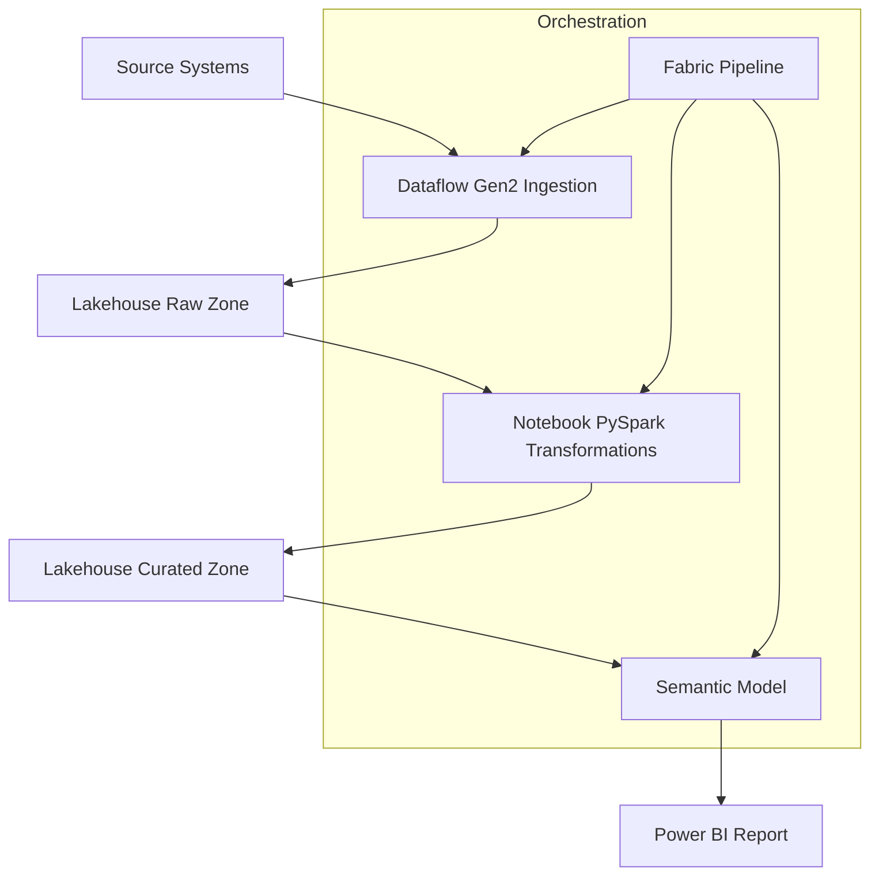

# Project 2: End-to-End Fabric Pipeline Architecture

This document describes the architecture of the ingestion, transformation, and orchestration pipeline implemented using Microsoft Fabric. The design demonstrates how operational data moves through a governed, scalable, and automated analytics environment.

---

## 1. Purpose

The purpose of this project is to build a production-aligned data engineering pipeline that:

- Ingests data from external or internal sources  
- Processes and standardises raw data  
- Applies business transformations at scale  
- Produces curated, analytics-ready tables  
- Refreshes Power BI semantic models  
- Automates scheduling, orchestration, and deployment  

This pipeline demonstrates Microsoft Fabric’s ability to support enterprise data engineering workloads.

---

## 2. High-Level Architecture Diagram

---

## 3. Core Components

### 3.1 Dataflow Gen2 (Ingestion Layer)

- Schema standardisation

- Data type enforcement

- Basic transformations

- Load auditing and logging

### 3.2 Lakehouse Raw Zone

- Immutable storage of source data

- Auditable and replayable

### 3.3 Notebook Transformations (PySpark)

- Scalable data transformations

- Joins, aggregations, cleansing

- Delta table optimisation

### 3.4 Curated Lakehouse Zone

- Model-ready curated tables

- Conformed dimensions

### 3.5 Power BI Semantic Model

- Connects to curated tables

- Supports enterprise BI

### 3.6 Fabric Pipeline (Orchestration)

- Schedules ingestion

- Runs transformations

- Refreshes semantic models

---

## 4. Process Flow

### 1. Ingestion:
Dataflow loads raw data into OneLake.

### 2. Raw Zone Storage:
Source data is stored without modification for audit/compliance.

### 3. Transformation:
PySpark notebook processes raw data into curated delta tables.

### 4. Curated Storage:
Curated tables feed semantic models in Power BI.

### 5. Reporting:
Data is visualised in governed Power BI dashboards.

### 6. Automation:
Fabric Pipeline orchestrates each step, ensuring reliability.

---

## 5. Best Practices Applied

- Use Dataflows for ingestion and basic transformations

- Keep heavy transformations in notebooks

- Use Lakehouse Delta tables for performance

- Separate raw and curated layers

- Keep semantic models thin and governed

- Ensure lineage coverage from sources to reporting

---

## 6. Governance and Security

- Access control applied at workspace and Lakehouse folder levels

- Sensitive tables protected using RLS/OLS at the semantic model

- Naming conventions align with enterprise standards

- Data lineage maintained using Fabric's lineage view

---

## 7. Deployment Approach

- Git-backed development for pipelines, notebooks, and semantic models

- Deployment pipelines enforce Dev → Test → Prod progression

- GitHub Actions can be used for automated validation

- Release documentation for every deployment wave

---

## 8. Summary

This pipeline architecture represents a scalable, production-ready data engineering workflow. It ensures reliable ingestion, transformation, governance, and distribution of analytics-ready data across an enterprise environment.