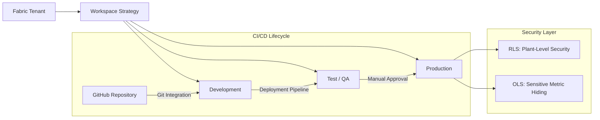

# Project 3: Fabric Governance, Security & CI/CD Architecture

## 1. Overview

This project defines the enterprise-grade governance, security, and CI/CD framework for the Energy Analytics Platform built on Microsoft Fabric. It provides the operational backbone that ensures data transformation logic and analytics assets are secure, compliant, version-controlled, and reliably deployed across environments.

This project complements:
- Project 1: Power BI Semantic Models & Analytics
- Project 2: Spark-Based Data Transformation Notebook

---

### Objectives

- Establish secure, governed workspaces across the platform
- Enforce environment separation (Dev → Test → Prod)
- Enable automated CI/CD using GitHub and Fabric Deployment Pipelines
- Ensure auditability and compliance for energy-sector data
- Provide observability for pipelines, capacity, and data lineage

---

## 2. Governance & DevOps Architecture Overview



---

## 3. Workspace & Environment Strategy

The platform is divided into three isolated environments to ensure stability and controlled releases:

### 3.1 Development
- Active development of the Spark transformation notebook  
- Semantic model design and iteration  
- Rapid experimentation with Git-backed version control  

### 3.2 Test / QA
- Validation of transformation logic  
- User Acceptance Testing (UAT)  
- Performance and data quality checks  

### 3.3 Production
- Locked-down environment  
- Hosts production-ready datasets produced by the transformation notebook  
- Serves trusted data to Power BI reports and business users  

---

## 4. Data Transformation Model

A suite of modular Spark notebooks is responsible for:
- Reading raw data from OneLake  
- Applying all business transformations and calculations  
- Writing curated datasets for analytical consumption  

This approach:
- Simplifies lineage and maintenance  
- Ensures consistent logic across environments  
- Makes deployment and rollback straightforward via Git  

---

## 5. Security Model

Security is enforced using Microsoft Fabric’s native capabilities.

### Row-Level Security (RLS)
- Ensures users only see data for plants they are authorized to access  
- Implemented at the semantic model level  

### Object-Level Security (OLS)
- Hides sensitive columns such as financial or emissions metrics  
- Protects commercially sensitive data  

---

## 6. Governance Standards

### Energy Analytics Table Naming Conventions
This outlines the naming standards for tables within the Energy Analytics project, ensuring consistency, readability, and governance across notebooks, SQL endpoints, and the Lakehouse.

### 6.1. Context

- Notebooks follow the pattern:
`nb_transform_energy_data`, `nb_validate_energy_tables`

- SQL Analytics endpoint: `lh_energy_analytics`

- Lakehouse: `lh_energy_analytics`

Proper table naming is critical for **clarity, maintainability, and integration** with Lakehouse / Medallion architecture.

### 6.2. Naming Convention

**Standard Pattern**
`<prefix>_<project>_<subject>_<grain>`

- prefix – Type of table: `fact`, `dim`, `stg` (staging), etc.

- project – Project name (optional if schema implies project)

- subject – What the table is about: `energy`, `heating`, `co2`, etc.

- grain – Aggregation or granularity: `daily`, `monthly`, etc.

Example:
```
fact_heating_emissions_daily
fact_energy_analytics_kpi_daily
dim_date
dim_plant
```

### 6.3. Recommended Approach

Two options for naming tables: 


**Option A — Project implied by schema (simpler)**

Schema: `Energy-Analytics.dbo`

`<prefix>_<subject>_<grain>`

Examples:
```
fact_energy_daily
fact_heating_emissions_daily
dim_date
dim_plant
```


**Option B — Project included in table name (stricter governance)**

`<prefix>_<project>_<subject>_<grain>`

Examples:
```
fact_energy_analytics_heating_daily
fact_energy_analytics_daily
dim_energy_analytics_plant
```
Decide one approach and apply consistently across all tables and notebooks.


### 6.4. Current Issues Observed
| Table            | Issue                        | Suggested Fix      |
| ---------------- | ---------------------------- | ------------------ |
| dimdate          | Missing underscore           | dim_date           |
| dimplant         | Missing underscore           | dim_plant          |
| factenergydaily  | Missing underscores, unclear | fact_energy_daily  |
| factheatingdaily | Missing underscores, unclear | fact_heating_daily |
| factco2daily     | Missing underscores, unclear | fact_co2_daily     |


### 6.5 Best Practices 
- Use **underscores** to separate logical components.

- Decide if **project name** will be in the table name or implied by schema.

- Keep **granularity** (```daily```, ```monthly```, ```hourly```) explicit in fact tables.

- Align **notebooks, SQL Analytics endpoints, and Lakehouse tables** with the same naming convention.


### 6.6. Next Steps
- Enforce the naming standard across all new tables.

- Optionally, generate a **rename map** for existing tables to align with the chosen standard.

- Maintain consistency with **Lakehouse / Medallion architecture governance.**

---

## 7. Certification
- Only validated semantic models in the Production workspace are endorsed  
- Endorsed models represent the authoritative source for reporting  

---

## 8. CI/CD & Deployment Process

### Git Integration
- Spark transformation notebook  
- Semantic model metadata  
- Deployment artifacts synchronized with GitHub  

### Deployment Pipelines
- Controlled promotion from Dev → Test → Prod  
- Manual approval gates for Production  

### Automated Validation
- Data quality and validation checks must pass before promotion  
- Prevents faulty logic from reaching Production  

### Audit Trail
- Git commit history provides full traceability  
- Clear visibility into code and metadata changes  

---

## 9. Monitoring & Observability

### Notebook Monitoring
- Track Spark execution duration and failures  

### Capacity Management
- Monitor Fabric Capacity Unit (CU) usage  
- Optimize cost and execution efficiency  

### Data Lineage
- Use Fabric Lineage View for end-to-end traceability  
- Visibility from raw OneLake sources to Power BI reports  

---

## 10. Summary

Project 3 demonstrates a governed, production-ready Microsoft Fabric platform centered around a single, well-controlled Spark transformation notebook. By combining strong security, structured CI/CD, and clear environment separation, the platform achieves the reliability and maintainability expected from a Tech Lead–level implementation.
