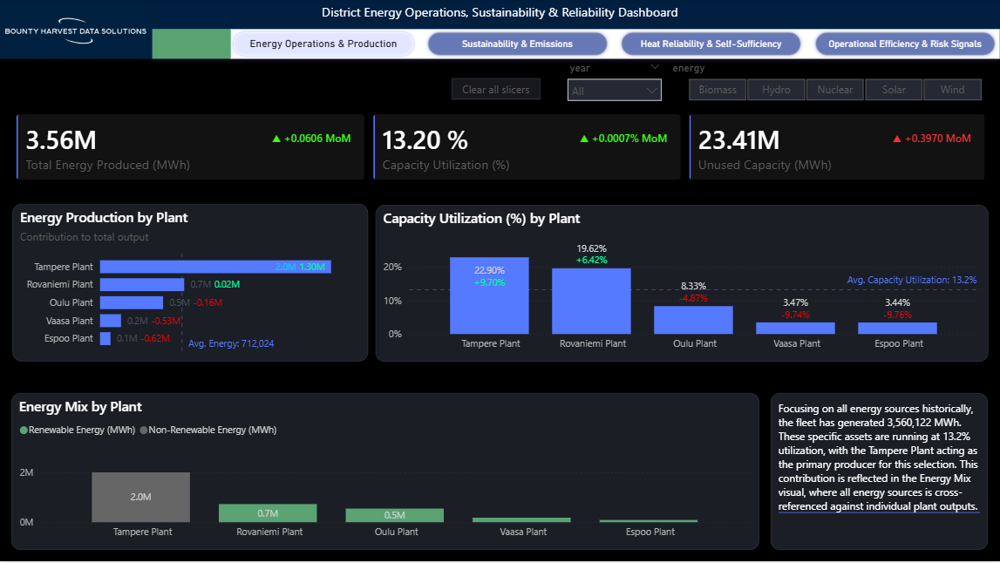
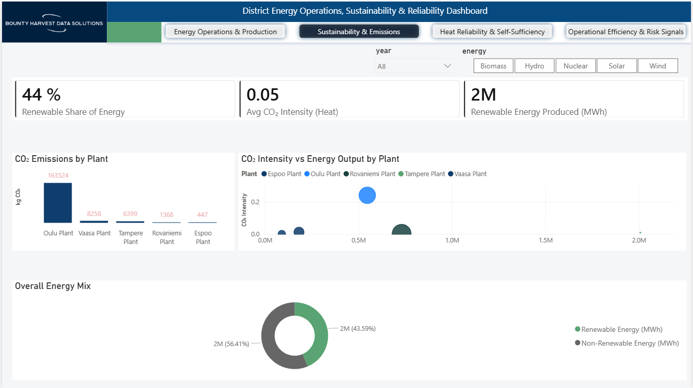
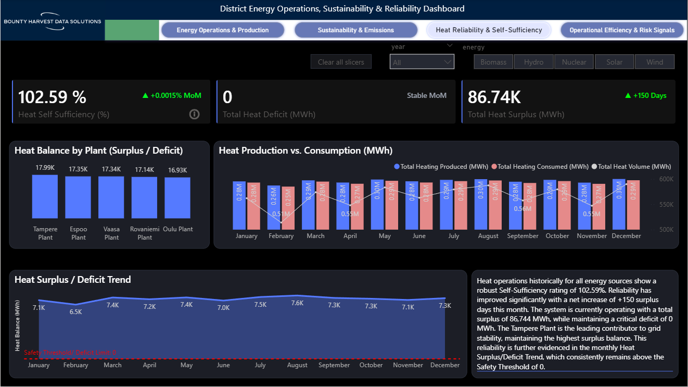

# Project 1: Energy BI & Analytics Solution

**Executive Summary:** A high-performance analytics suite refactoring raw energy telemetry into a governed Star Schema. By unifying Medallion Architecture with Executive Decision Support, this platform identified **€4.9M** in avoidable costs and provided a blueprint for **CAPEX-free scaling**.

---

## 1. The Vision: Delivering Strategic Business Value

This platform unifies siloed streams into a **Single Source of Truth** enabling data-driven decisions across three critical pillars:

* **Operational Excellence:** Optimizing plant load factors to reclaim **23.41M MWh** of unused capacity.
* **ESG Leadership:** Real-time tracking of carbon intensity, maintaining a fleet average of **0.05 kg/MWh** (Target: 0.10).
* **Grid Resilience:** Monitoring heat balance to sustain a **102.59% self-sufficiency** rating.

---

## 2. Executive Interface & Strategic Insights

### 1. Energy Operations: Asset Scaling & CAPEX Optimization
**Focus:** Asset Scaling & CAPEX Optimization.
* **Strategic Insight:** Identified **Tampere Plant** as the primary volume driver (2.0M MWh) while highlighting a **+0.3970 MoM** increase in unused capacity—representing a massive opportunity for scaling without new investment.
* **HSEQ Context:** Monitoring unused capacity allows for assembly line scaling without over-stressing existing infrastructure.

****

### 2. Sustainability: The "Star Plant" Framework
**Focus:** Decarbonization and ESG Compliance.
* **Strategic Insight:** Utilized a quadrant-based **CO₂ Intensity vs. Output** analysis to identify **Oulu Plant** as an intensity outlier (0.24 kg/MWh), enabling surgical CAPEX intervention rather than inefficient fleet-wide upgrades.

****

### 3. Reliability: Predictive "Safety Margin" Monitoring
**Focus:** Grid Stability and "Safety Margin" Monitoring.
* **Strategic Insight:** Confirmed **102.59% Heat Self-Sufficiency** with zero deficit. By tracking "Surplus Days," the platform transitions from reactive reporting to predictive maintenance.

****

### 4. Operational Efficiency: Bridging Waste & Finance
**Focus:** Financial Recovery and Waste Mitigation.
* **Strategic Insight:** Translated **81,744 MWh** of technical waste into a financial narrative representing **€4,904,640** in avoidable costs. This page bridges the gap between engineering "MWh" and corporate "€".

****

---

## 3. Data Model Architecture (Star Schema)

The semantic model follows a strictly governed star schema to ensure sub-second filtering and consistent KPI definitions across the enterprise.

### Fact Tables
- **FactEnergyProduction:** Granular telemetry from plant sensors.
- **FactDistrictHeating:** Metered demand vs. grid supply.
- **FactCO2Emissions:** Calculated intensity based on fuel type and throughput.

### Dimension Tables
- **DimDate:** Supporting complex Time-Intelligence (MoM, YoY, "Surplus Days").
- **DimPlant:** Metadata including location, capacity, and HSEQ status.
- **DimEnergySource:** Categorization for Renewable vs. Non-Renewable analysis.

---

## 4. Data Flow Architecture

The end-to-end flow leverages the Microsoft Fabric ecosystem, moving from raw ingestion to high-performance reporting.

---

## 5. Transformation Strategy

Fabric transformations follow a layered, scalable, and code-first pattern:

* **PySpark Engineering:** All business logic, standardization, and cleansing (e.g., Degree-Day Normalization) are implemented in Spark notebooks to handle high-volume energy datasets.
* **KPI Ingestion:** Business KPIs are computed upstream in Spark to ensure they are available to any tool consuming the Lakehouse.
* **Delta Lake Persistence:** Transformation outputs are written to the Gold layer in Delta format for ACID compliance.
* **Validation Gates:** Automated quality checks run within the pipeline to ensure data consistency before the reporting layer refreshes.

---

## 6. Semantic Layer & DAX

The semantic layer standardises how business metrics are defined and consumed:

* **Import Mode:** Utilizes the VertiPaq engine for sub-second visual interactivity and high-performance analytical queries.
* **Unified Measure Library:** Centralized DAX measures ensure KPI consistency across all report pages.
* **Calculation Groups:** Implemented to allow users to toggle the entire report between **MWh**, **GJ**, and **Financial (€)** views dynamically.
* **Security:** **Row-Level Security (RLS)** restricts access to sensitive plant data based on user roles and geographic responsibility.

---

## 7. Deployment & DevOps Architecture

This project is built for production, following enterprise-grade release standards:

* **Git Integration:** Version control for semantic models (BIM files), reports, and Lakehouse artifacts.
* **Deployment Pipelines:** A structured **Dev → Test → Production** flow ensures stability and rigorous testing before release.
* **Automation:** GitHub Actions orchestrate CI/CD validation where required to maintain code quality.
* **Lineage:** Full visibility from raw source files to final Power BI visuals via Fabric Lineage View.

## 8. Governance Considerations

The architecture aligns with enterprise-grade governance requirements:

* **Workspace Separation:** Dedicated environments for development and production to prevent "bleeding" of unverified code.
* **Naming Standards:** Enforced consistency (e.g., `FACT_`, `DIM_`) across all Fabric items for discoverability.
* **Dataset Certification:** Clearly identifies validated assets for business decision-making.
* **Monitoring:** Dashboards track refresh health, capacity consumption, and usage metrics.

---

## 9. Summary

This architecture provides a scalable, governed, and maintainable analytics foundation. By combining a **Spark-driven data engineering backbone** with a **high-performance Import Mode semantic layer**, it meets the high availability and reliability needs of large energy-sector organisations. 

It is tailored for enterprises requiring high availability and consistent KPIs across multiple business units, bridging the gap between engineering "MWh" and corporate "€" to prioritize the mitigation of **81,744 MWh** in recorded efficiency risk.

---

## Summary Outcomes
* **€4.9M** identified in avoidable efficiency costs.
* **100% Compliance** with ESG carbon intensity targets.
* **Zero Heat Deficit** maintained through predictive reliability monitoring.

---

## 🧭 Navigation
- **[View Project 2: Engineering & Pipelines](../../projects/project2-fabric-pipeline/README.md)** 
- **[View Project 3: Fabric Governance, Security and CI/CD Framework](../project3-governance-cicd/docs/project3_governance_framework.md)**
- **[Back to Portfolio Home](../../README.md)**

