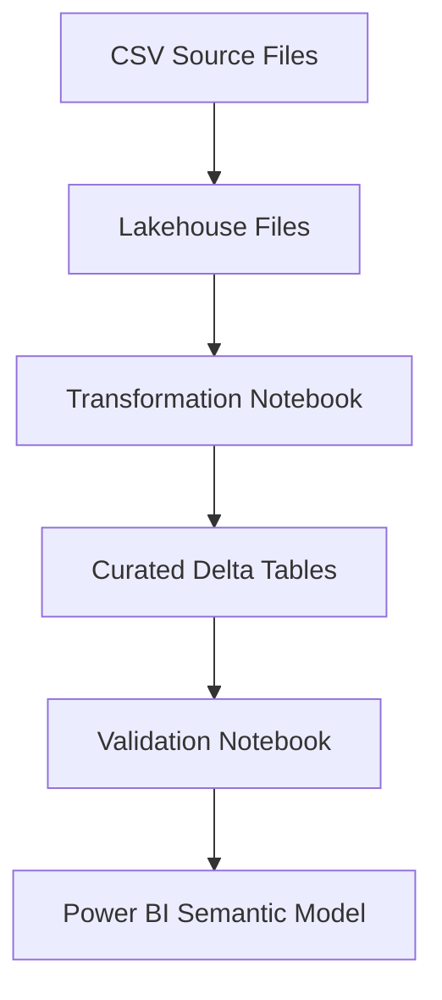

# Project 2 — Microsoft Fabric Data Engineering Pipeline

This project implements an end-to-end **data engineering workflow using Microsoft Fabric**, covering Lakehouse-based ingestion, PySpark transformations, dimensional modeling, data quality validation, and pipeline orchestration.

The project demonstrates how a Fabric-based data platform can be structured to support reliable analytics and reporting in an energy-sector context, with all business KPIs computed upstream in Spark.

---

## 1. Purpose

The purpose of this project is to:

- Ingest operational energy datasets (production, district heating, CO₂ emissions)
- Store source data in a Microsoft Fabric Lakehouse
- Transform raw data into curated, analysis-ready Delta tables
- Apply a dimensional (star-schema-oriented) data model
- Compute business KPIs upstream in PySpark
- Orchestrate transformations and validation using Fabric Pipelines
- Prepare clean, reliable data for Power BI semantic models (Project 1)

This reflects enterprise-grade data engineering practices expected for a **senior / Tech Lead–level role**.

---

## 2. Architecture Overview

The solution follows a modern **Microsoft Fabric Lakehouse architecture**:

- CSV source files stored in Lakehouse Files
- Delta tables created and managed in the Lakehouse
- PySpark notebooks for transformation and KPI computation
- A validation notebook enforcing data quality checks
- A Fabric Pipeline orchestrating notebook execution
- Power BI semantic models consuming curated tables (Project 1)

### High-Level Architecture

---

## 3. Key Artifacts
| Component               | Name / Location                          |
| ----------------------- | ---------------------------------------- |
| Lakehouse               | `lh_energy_analytics`                    |
| Transformation notebook | `notebooks/transform_energy_data.py`     |
| Validation notebook     | Executed via Fabric Pipeline             |
| Fabric pipeline         | `pl_energy_analytics_ingestion`          |
| Pipeline definition     | `pipelines/etl_energy_pipeline.json`     |
| Curated tables          | Lakehouse curated layer                  |
| Architecture docs       | `docs/project2_pipeline_architecture.md` |

---

## 4. Data Model (Curated Layer)

The curated layer follows a **star-schema-inspired design** suitable for analytics and reporting.

### Dimension Tables

#### **dimdate**
- date  
- year  
- quarter  
- month  
- day  
- day_of_week  

#### **dimplant**
- plant_id  
- plant_name  
- energy_source  
- installed_capacity_mw  
- commissioning_year  

The `dimplant` dimension is enriched using reference capacity data to enable capacity, utilization, and sustainability KPIs.

---

### Fact Tables

#### **factenergydaily**
- date  
- plant_id  
- mwh_produced  

#### **factheatingdaily**
- date  
- plant_id  
- heating_produced_mwh  
- heating_consumed_mwh  

#### **factco2daily**
- date  
- plant_id  
- co2_kg  

#### **fact_energy_kpi_daily**

- Production metrics enriched with capacity and renewable attributes

#### **fact_heating_kpi_daily**

- Heating balance and operational KPIs

#### **fact_heating_emissions_daily**
- date  
- plant_id  
- heating_produced_mwh  
- co2_kg  
- co2_kg_per_mwh_heat  

All fact tables join to `dimdate` and `dimplant` to support time-based, asset-based, and sustainability analysis.

---

## 5. Transformation Logic (PySpark)

All transformations are implemented in **PySpark** within the transformation notebook.

The transformation logic is responsible for:

- Standardising data types (dates, numeric fields)
- Creating authoritative dimension tables
- Enriching `dimplant` with installed capacity and commissioning year
- Joining fact and dimension data
- Computing business KPIs upstream in Spark
- Writing curated Delta tables to the Lakehouse

Transformations are designed to be:

- Deterministic  
- Idempotent  
- Safe to execute repeatedly within a Fabric Pipeline  

---

## 6. Business KPIs Computed in Spark

All major business KPIs are computed **upstream in Spark**, minimizing the need for complex DAX in Power BI.

### Electricity KPIs

- Theoretical maximum MWh per day  
  (`installed_capacity_mw × 24`)
- Load factor  
- Capacity utilization percentage  
- Unused capacity (MWh)  
- Renewable vs non-renewable energy production  
- Renewable energy percentage  

---

### District Heating KPIs

- Heating produced vs consumed  
- Heating balance (loss / surplus)  

---

### CO₂ & Sustainability KPIs

- Plant-level CO₂ emissions  
- CO₂ intensity per MWh of heat (`kg CO₂ / MWh`)  
- Renewable energy attribution  

These KPIs enable sustainability and efficiency reporting without complex downstream calculations.

---

## 7. Pipeline Design

The Fabric Pipeline (`pl_energy_analytics_ingestion`) orchestrates the data engineering workflow.

### Pipeline Activities

1. **Transform energy data**
   - Executes the PySpark transformation notebook
   - Creates and updates curated Delta tables
   - Applies controlled schema evolution

2. **Validate curated tables**
   - Confirms all curated tables exist
   - Verifies row counts are greater than zero
   - Acts as a quality gate before analytics consumption

This design enforces a clean separation between transformation logic and validation logic.

---

## 8. Validation Strategy

A dedicated validation notebook enforces lightweight but effective data quality checks:

- Table existence validation  
- Non-empty dataset checks  
- Pipeline failure on validation errors  

Validation is executed as part of the Fabric Pipeline, preventing incomplete or corrupted data from reaching analytics consumers.

---

## 9. Integration with Power BI

The curated Delta tables produced by this project are consumed by Power BI semantic models implemented in **Project 1**.

This project provides the **data engineering foundation** that supports:

- Clean semantic modeling  
- Simplified DAX  
- Reliable dashboard refreshes  
- Scalable analytics development  

---

## 10. What This Project Demonstrates

- Microsoft Fabric Lakehouse design  
- PySpark-based data transformations  
- Dimensional modeling for analytics  
- Business KPI computation upstream in Spark  
- Pipeline-based orchestration  
- Built-in data quality validation  
- Clear separation between engineering and analytics layers  

---

## 11. Status

**Project status:** Complete

All notebooks and pipelines execute successfully.  
Curated tables are available for reporting and analytics.

This project represents the **data engineering backbone** of the overall Energy Analytics Platform, complementing:

- **Project 1** — Power BI semantic modeling & dashboards  
- **Project 3** — Governance and CI/CD strategy

