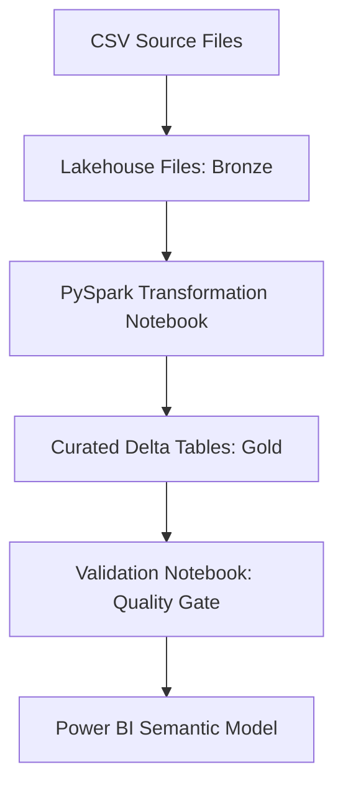

# Project 2 — Microsoft Fabric Data Engineering Pipeline

**Role:** Lead Data Engineer  
**Core Deliverable:** End-to-end Medallion Architecture transforming raw telemetry into €4.9M of actionable financial insights.

This project implements a robust **data engineering workflow using Microsoft Fabric**, covering Lakehouse-based ingestion, PySpark transformations, dimensional modeling, and automated quality gates.

---

## 1. Purpose
The purpose of this project is to unify disparate energy streams (production, heating, emissions) into a **Single Source of Truth**. By computing complex KPIs upstream in Spark, we ensure that the **€4,904,640 in avoidable costs** identified at the Tampere plant is calculated using a single, governed logic accessible to all downstream stakeholders.

---

## 2. Architecture Overview
The solution follows a modern **Microsoft Fabric Lakehouse architecture**:

* **Files (Bronze):** Raw CSV/API telemetry stored in OneLake.
* **Tables (Silver):** Cleaned and standardized Delta tables.
* **Tables (Gold):** Curated Star Schema enriched with business-critical KPIs.

```mermaid
flowchart TD
    A[CSV Source Files] --> B[Lakehouse Files: Bronze]
    B --> C[PySpark Transformation Notebook]
    C --> D[Curated Delta Tables: Gold]
    D --> E[Validation Notebook: Quality Gate]
    E --> F[Power BI Semantic Model]
```

---

## 3. Key Artifacts

The following components form the backbone of the engineering solution, ensuring a clear separation between raw ingestion, transformation logic, and quality assurance.

| Component               | Name / Location                               | Role                                      |
| ----------------------- | --------------------------------------------- | ----------------------------------------- |
| **Lakehouse** | `lh_energy_analytics`                         | Unified storage for Bronze/Silver/Gold layers. |
| **Transformation Notebook** | `notebooks/transform_energy_data.py`      | PySpark logic for KPI and Star Schema creation. |
| **Validation Notebook** | `notebooks/validate_curated_data.py`          | Quality gate for row counts and schema integrity. |
| **Fabric Pipeline** | `pl_energy_analytics_ingestion`               | Orchestrator for end-to-end execution.     |
| **Pipeline Definition** | `pipelines/etl_energy_pipeline.json`          | JSON export for CI/CD and Git integration. |
| **Architecture Docs** | `docs/project2_pipeline_architecture.md`      | Detailed technical specifications.         |

---

---

## 4. Data Model (Curated Layer)

The curated layer implements a **Star Schema** optimized for high-performance analytical queries. By computing efficiency and risk metrics at the model level, we ensure a "Single Source of Truth" for the **€4.9M recovery narrative**.

### Dimension Tables
* **dimdate:** Enables Time-Intelligence for MoM trends and seasonal "Surplus Day" tracking.
    * *Schema: date, year, quarter, month, day, day_of_week*
* **dimplant:** Enriched with HSEQ metadata and capacity data to drive utilization KPIs.
    * *Schema: plant_id, plant_name, energy_source, installed_capacity_mw, commissioning_year*

---

### Fact Tables (The "Engine" of the Insights)
Fact tables are partitioned by domain to handle high-volume telemetry while delivering granular strategic insights:

| Table Name | Primary Metrics | Strategic Value |
| :--- | :--- | :--- |
| **factenergydaily** | `mwh_produced` | Tracks raw electricity output across the fleet. |
| **factheatingdaily** | `heating_produced`, `consumed` | Computes the daily heat balance for grid reliability. |
| **factco2daily** | `co2_kg` | Direct sensor-level tracking of carbon footprint. |
| **fact_energy_kpi_daily** | Capacity Utilization % | Identifies the **23.41M MWh** of untapped scaling potential. |
| **fact_heating_kpi_daily** | Operational Stability | Confirmed the **zero-MWh heat deficit** across all plants. |
| **fact_heating_emissions_daily** | `co2_kg_per_mwh_heat` | Pinpointed the **0.24 kg/MWh** outlier at the Oulu Plant. |

---

## 5. Transformation Logic (PySpark)

All business logic is implemented in **PySpark** notebooks, prioritizing scalability and code-first maintenance.

* **Standardization:** Normalizing disparate sensor telemetry into standardized units (MWh and GJ).
* **Enrichment:** Joining raw production data with plant capacity dimensions to compute real-time utilization.
* **Idempotency:** Notebooks are designed to be safe for re-execution, ensuring that a pipeline retry does not result in duplicate or corrupted data.
* **Performance:** Leveraging Delta Lake features (Z-Order, V-Order) to optimize query speed for Project 1's dashboards.

---

## 6. Business KPIs Computed in Spark

To maintain high performance in Power BI and ensure logic consistency, all complex KPIs are computed **upstream in Spark**:

### Electricity & Grid KPIs
* **Theoretical Maximum MWh:** `installed_capacity_mw × 24`
* **Unused Capacity:** Identification of the **23.41M MWh** idle capacity in Southern plants.
* **Renewable Energy %:** Dynamic attribution of fuel types to total production.

### Sustainability & Financial KPIs
* **CO₂ Intensity:** `kg CO₂ / MWh` calculated at the asset level (identifying Oulu as the 0.24 kg/MWh outlier).
* **Avoidable Cost (€):** Application of financial multipliers to the **81,744 MWh** of recorded efficiency risk.

---

## 7. Pipeline Design & Validation Strategy

The Fabric Pipeline (`pl_energy_analytics_ingestion`) orchestrates the workflow and enforces **Quality Gates** to protect downstream reporting.

### Pipeline Activities:
1.  **Transformation:** Executes PySpark logic to refresh the Gold layer.
2.  **Validation Gate:** A dedicated notebook that verifies:
    * **Table Existence:** Ensures all 6 curated tables are present.
    * **Non-Zero Checks:** Confirms that data volume meets expected thresholds (preventing "Empty Dashboard" scenarios).
    * **Logic Sanity:** Flags a failure if the efficiency risk exceeds the 5,000 MWh max allowable waste line.

---

## 8. Integration with Power BI (Project 1)

This engineering backbone enables the high-impact analytics seen in Project 1 by providing:

* **Clean Semantic Modeling:** Reduced need for complex DAX "calculate" statements.
* **DirectLake Readiness:** Optimized Delta tables for sub-second report interactivity.
* **Auditability:** Full end-to-end lineage from the raw telemetry CSV to the final Euro (€) recovery visual.

---

## 9. What This Project Demonstrates

- Microsoft Fabric Lakehouse design  
- PySpark-based data transformations  
- Dimensional modeling for analytics  
- Business KPI computation upstream in Spark  
- Pipeline-based orchestration  
- Built-in data quality validation  
- Clear separation between engineering and analytics layers  

---

## 10. Status

**Project status:** Complete

All notebooks and pipelines execute successfully.  
Curated tables are available for reporting and analytics.

This project represents the **data engineering backbone** of the overall Energy Analytics Platform, complementing:

- **Project 1** — Power BI semantic modeling & dashboards  
- **Project 3** — Governance and CI/CD strategy

---
## 🧭 Navigation
- **[View Project 1: Energy BI & Analytics Solution](../../projects/project1-energy-bi/README.md)** 
- **[View Project 3: Fabric Governance, Security and CI/CD Framework](../project3-governance-cicd/docs/project3_governance_framework.md)**
- **[Back to Portfolio Home](../../README.md)**

