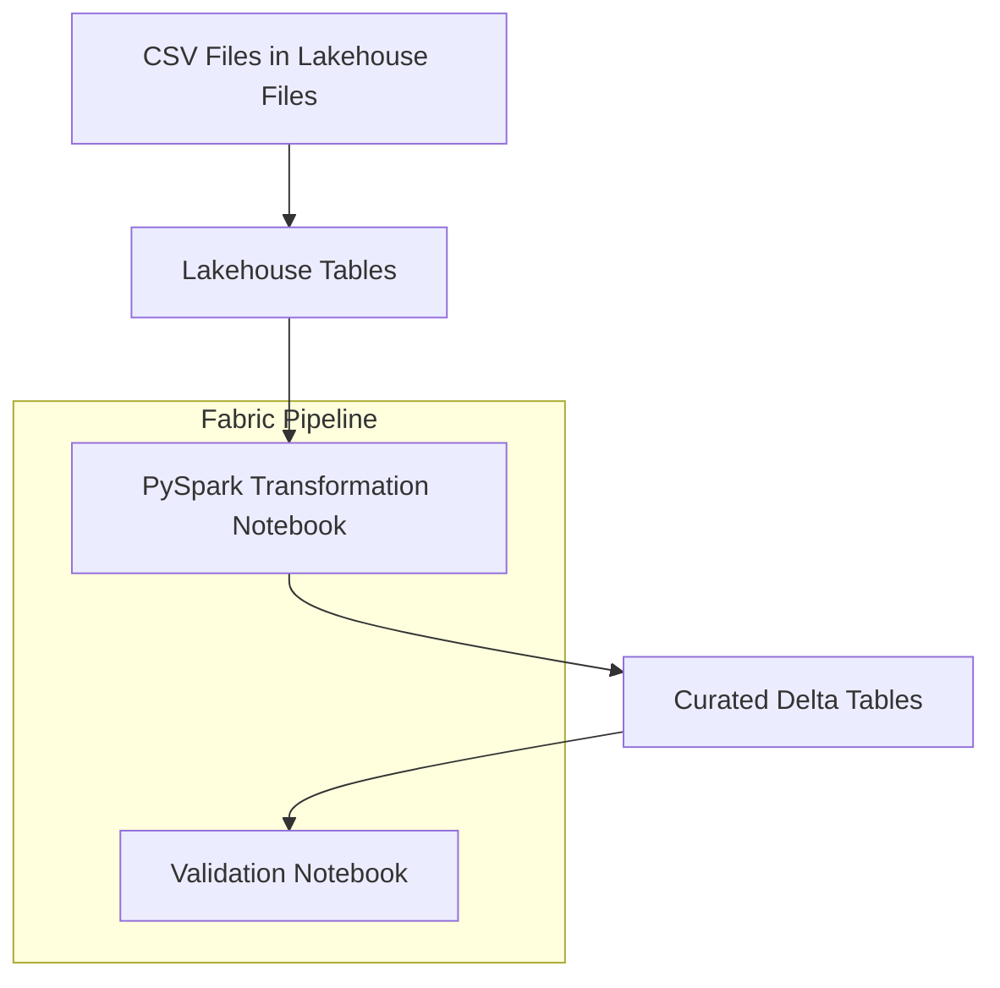

# Project 2: Fabric Pipeline Architecture (End-to-End Data Engineering)

This document outlines the end-to-end data engineering architecture implemented in **Project 2** using Microsoft Fabric.  
It describes how raw energy datasets are transformed into curated, analytics-ready Delta tables using PySpark and Fabric Pipelines.

The architecture reflects a **production-aligned data engineering pattern** suitable for enterprise energy analytics.

---

## 1. Purpose

The pipeline is designed to:

- Ingest operational datasets for energy production, district heating, and CO₂ emissions
- Store source data in a Lakehouse using Delta format
- Perform validated, scalable PySpark transformations
- Produce curated, analytics-ready Delta tables
- Enforce basic data quality checks through pipeline validation
- Provide a clean data engineering foundation for downstream analytics

This architecture supports the creation of reusable, governed data products for energy analytics use cases.

---

## 2. High-Level Architecture Diagram

---

## 3. Components Overview

### 3.1 Lakehouse (Raw & Curated Tables)

- Stores data in Delta format
- Supports ACID transactions and schema evolution
- Separates raw source data from curated analytics tables
- Acts as the single source of truth for downstream analytics

---

### 3.2 PySpark Transformation Notebook

- Cleans and standardises raw datasets
- Creates authoritative dimension tables (`dimdate`, `dimplant`)
- Enriches plant data with installed capacity and commissioning year
- Joins fact and dimension data
- Computes business KPIs upstream in Spark
- Writes curated Delta tables to the Lakehouse

All transformations are deterministic, idempotent, and safe to run repeatedly.

---

### 3.3 Lakehouse Curated Zone

- Contains domain-ready Delta tables
- Optimised for analytics and reporting
- Clear separation between ingestion logic and business logic
- Designed for consumption by Power BI semantic models (Project 1)

---

### 3.4 Validation Notebook

- Verifies curated tables exist
- Ensures datasets are non-empty
- Acts as a quality gate in the pipeline
- Prevents downstream consumption of incomplete or invalid data

---

### 3.5 Fabric Pipeline

- Orchestrates notebook execution in sequence
- Runs transformation logic first
- Executes validation checks after transformations
- Provides monitoring, logging, and scheduling

---

## 4. Process Flow

- CSV files are uploaded to Lakehouse Files
- Lakehouse tables are created and maintained in Delta format
- Transformation notebook reads Lakehouse tables and applies business logic
- Curated tables are written back to the Lakehouse
- Validation notebook confirms data quality
- Pipeline completes only if all validation checks succeed

---

## 5. Best Practices Applied

- Raw → Curated separation
- Delta Lake for reliability and performance
- Upstream KPI computation in Spark
- Dimensional modeling for analytics
- Clear notebook structure and modular logic
- Pipeline-based orchestration
- Data quality enforcement before analytics consumption

---

## 6. Security & Access Control

- Workspace-level roles restrict access to Lakehouse assets
- Raw and curated tables can be governed independently
- Downstream security (e.g. RLS) applied at semantic model level (Project 1)

---

## 7. Scope Clarification

This project focuses **exclusively on data engineering**.

The following are intentionally **out of scope for Project 2**:

- Semantic model refresh orchestration
- CI/CD automation
- Deployment Pipelines (Dev → Test → Prod)

These capabilities are handled in separate projects to maintain a clean separation of concerns.

---

## 8. Summary

Project 2 delivers a complete, production-aligned **Microsoft Fabric data engineering pipeline**.

It demonstrates:

- Lakehouse-based data engineering
- PySpark transformations and KPI computation
- Dimensional modeling
- Pipeline orchestration
- Built-in data validation

This project forms the **data engineering backbone** of the Energy Analytics Platform and directly supports downstream semantic modeling and reporting.
