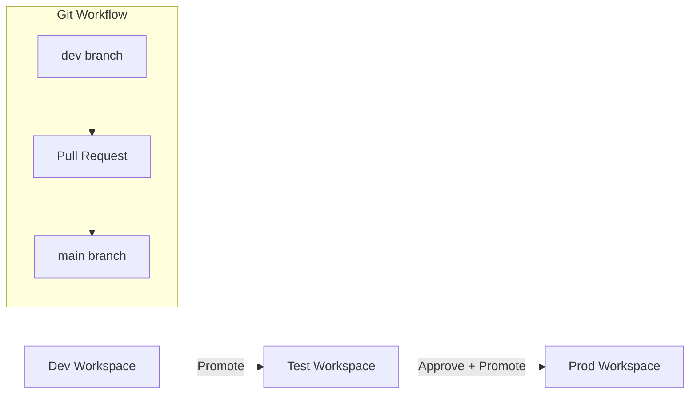

# Fabric Deployment Pipeline (Dev → Test → Prod)

This document describes the promotion process for Fabric assets using Deployment Pipelines and GitHub integration. It ensures that data engineering and BI assets are moved through environments with high integrity.

---

## 1. Purpose

- Ensure safe deployment of Fabric artifacts
- Enforce quality checks
- Provide traceability between environments
- Support incremental delivery

---

## 2. Architecture Overview

---

## 3. Pipeline Stages

### **Stage 1: Development**
Engineers develop and iterate on:

- **PySpark Notebooks** (Standardization & Transformation)

- **Fabric Pipelines** (Orchestration)

- **Semantic Models** (Star Schema / Import Mode)

GitHub sync ensures every code change is versioned.

### **Stage 2: Test**
Automated and manual validation:

- **Notebook Quality Gates:** Execution of validation notebooks.

- **UAT:** Business logic verification for Energy KPIs.

- **Model Refresh:** Testing VertiPaq compression and refresh performance.

### **Stage 3: Production**
Manual approval required via Deployment Pipelines. Promotion triggers:

- **Production Model Refresh:** Pulling Gold Delta tables into the high-performance memory engine.

- **Operational Monitoring:** Integration with the platform health dashboard.

---

## 4. Validation Checklist

Before promotion:
- Notebook executes successfully  
- Pipeline runs end-to-end  
- No schema mismatches  
- Approval recorded in GitHub PR  
- All CI checks pass  

---

## 5. Summary

This deployment pipeline ensures safe, validated progression of Fabric assets from development to production, with GitHub providing traceability and control.
